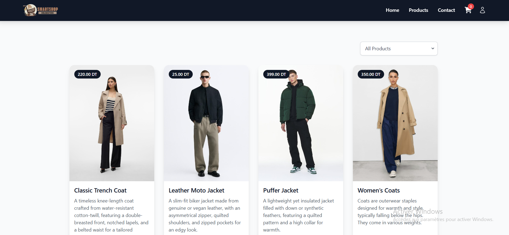
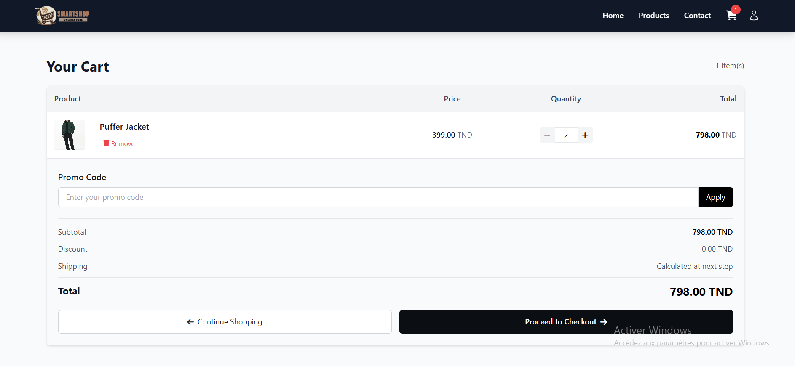
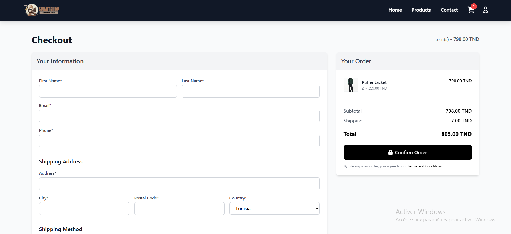
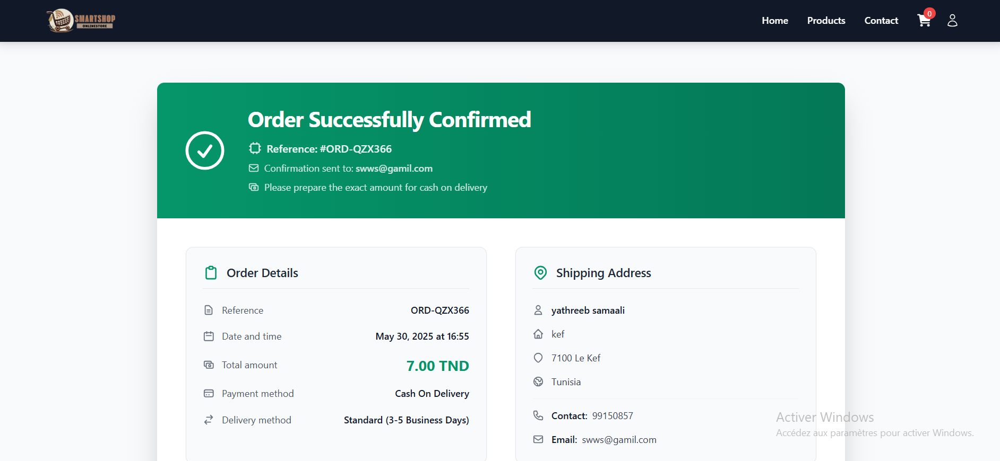
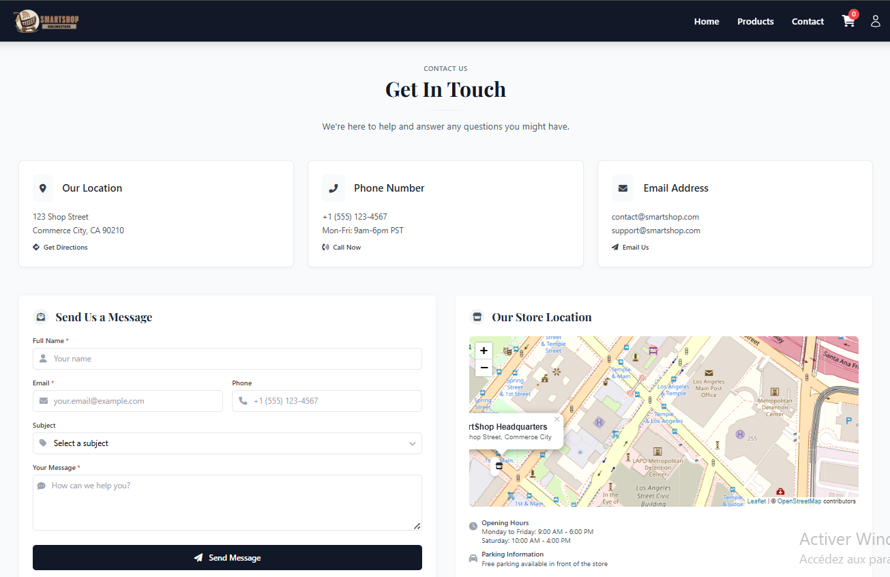
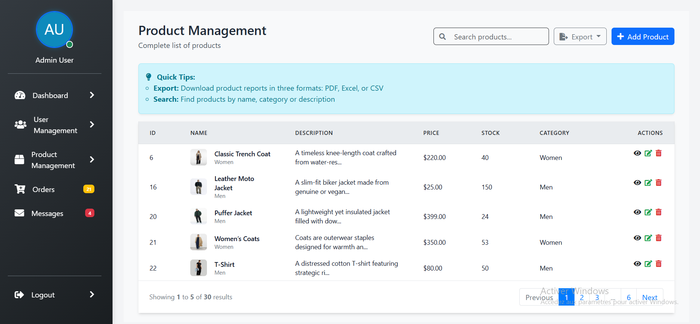
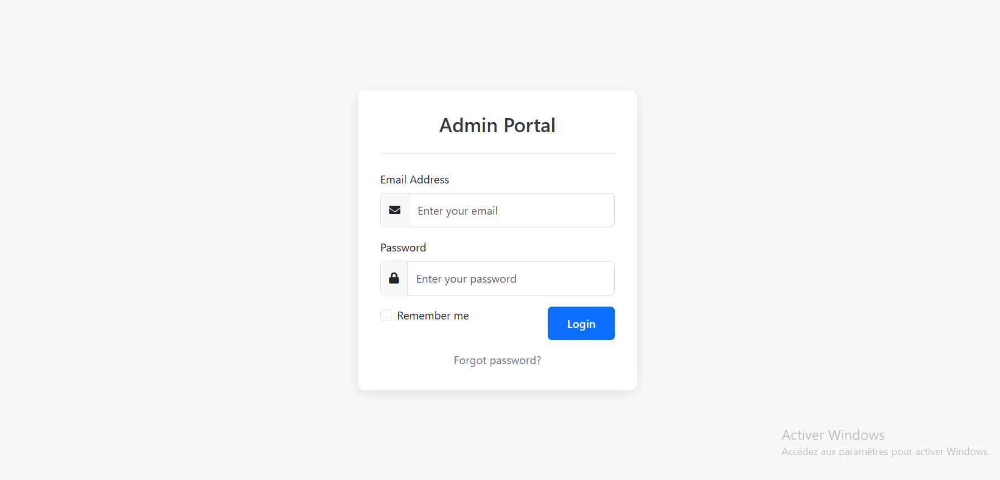

# 🛒 SmartShop – Laravel E-commerce Project

SmartShop is a complete e-commerce web application built with Laravel and MySQL. It features a user-friendly interface, secure authentication, and a basic product/cart/order system, making it an ideal starter template for building robust online stores.

---

## 📌 Project Description

The project uses:
- **Laravel 10** for backend logic and routing
- **MySQL** as the database

---

## 🚀 Installation

1. **Clone the repository**
   ```bash
   git clone https://github.com/YathrebSamaali/SmartShop.git
   cd smartshop

2. **Install dependencies**
   ```bash
   composer install
   npm install && npm run dev

## ⚙️ Environment Setup
1. **Update your .env with your database credentials:**
    ```bash
    DB_CONNECTION=mysql
    DB_HOST=127.0.0.1
    DB_PORT=3306
    DB_DATABASE=smart_shop_db
    DB_USERNAME=root
    DB_PASSWORD=

2. **Run the following commands:**

    ````bash
    php artisan migrate
    php artisan db:seed # Optional

## 🛠️ Usage
1. **Start the development server**
    ````bash
    php artisan serve
2. **Access the application**
    ````bash
    http://localhost:
    
> ⚠️ **Note:**  
> To access the **admin login interface**, make sure to visit:  
> [http://localhost:8000/admin](http://localhost:8000/admin)  
> 
> ✅ Default Admin Credentials:  
> **Email:** `admin@smart.com`  
> **Password:** `password123`

## 👨‍💼 Screenshots









